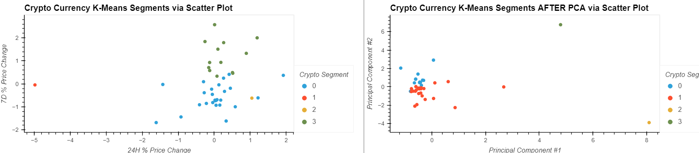

# ETF Analysis with SQL and Viewing it Using Voila

This Jupyter notebook is meant to demonstrate the difference in results of the same crypto currency portfolio data prepared in different ways using K-Means along with StandardScaler and PCA which also come with SciKit, and ends with a conclusional insight on how one might try to use the differences in results.
This Jupyter notebook contains the to kinds of resulting data of an analysis of a crypto currency portfolio, being two separate elbow plots for each prepared data set showing how best to cluster the scatter plots which come after each.

---

## Technologies

### Libraries:
* Pandas
* hvplot.pandas
* Path from pathlib
* KMeans from sklearn.cluster
* PCA from sklearn.decomposition
* StandardScaler from sklearn.preprocessing

The language of this application is Python on the Anaconda developement environment, used on Jupyter Lab. The libraries used that come with Anaconda Python are Pandas, scikit-learn, and Path from pathlib. To use hvplot, it must be installed as a PyViz package.

---

## Installation Guide

To install HvPlot, enter `conda install -c pyviz hvplot` to the terminal. Enter `conda list hvplot` after that to confirm its installation.

---

## Usage

#### Example of a K-Means elbow curve:

#### Example of a K-Means segmented scatter plot:

All info is already input and worked on within the Jupyter file. Simply start from the top and go down the page to view relevant data, calculations, analysis, and notes.

---

## Contributor

Isaiah T Tensae